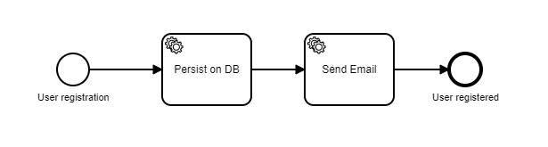

# camunda-workflow
Workflow driven test application using Camunda BPM and .NET Core 3.1

------------

This sample application was built with the sole purpose of exercising a [Camunda BPM Process](https://camunda.com/ "Camunda BPM Process") upon an API call inside a .NET Core 3.1 project.

This solution has two projects:

- **UserRegistrationApi**: Contains a POST endpoint that captures de user data and starts the Camunda Process.
- **UserRegistrationWorkerService**: Contains the workers implementation responsbile for executing the external tasks defined in the workflow.

This is the workflow definition, built with **Camunda Modeler**:

The workflow definition can be found inside the folder `/Workflows`.

This project uses the C# client Camunda library [Camunda.Api.Client](https://github.com/jlucansky/Camunda.Api.Client "Camunda.Api.Client").

### Running the solution:

1. Start Camunda Server.
2. Deploy the workflow to http://localhost:8080/engine-rest (if you wish feel free to change this address but remember to also change the connection path inside the projects).
3. Run both projects of the solution.
4. Send a `POST /users/register` request. Payload example:

`curl -X POST "https://localhost:44340/users/register" -H "accept: */*" -H "Content-Type: application/json" -d "{\"name\":\"user1\",\"password\":\"1234\",\"repeatPassword\":\"1234\"}"`
